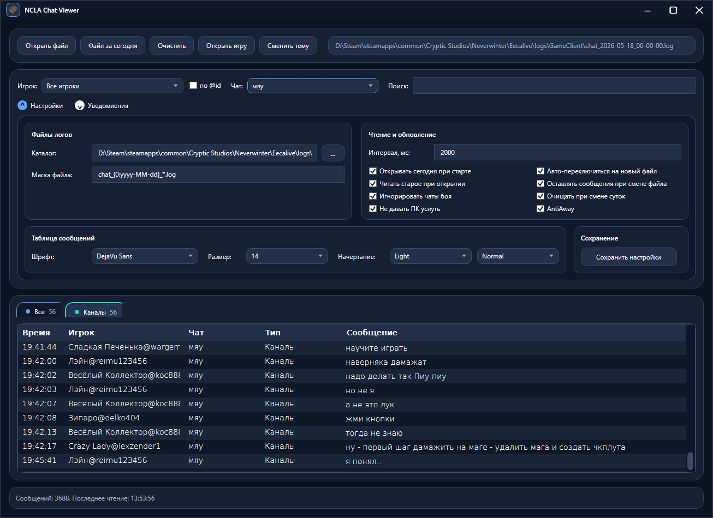
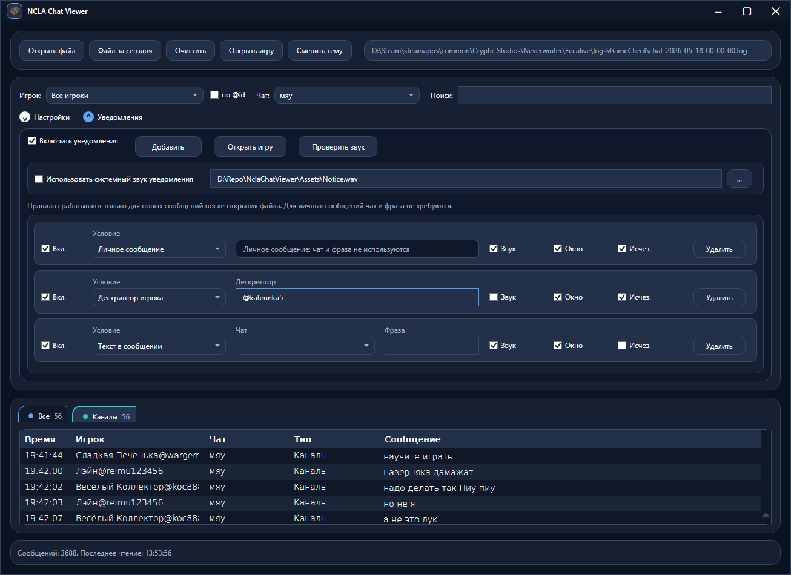
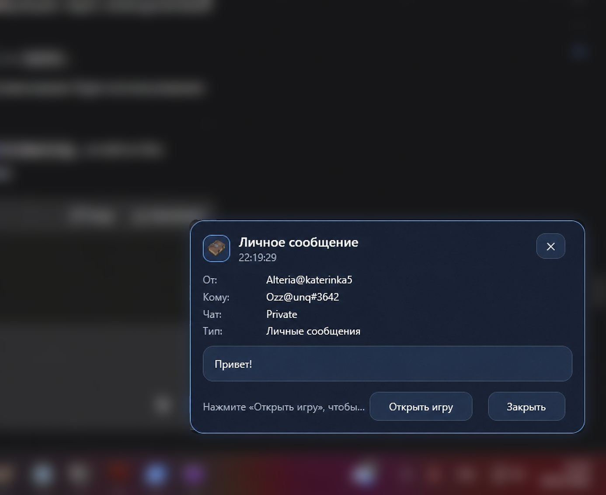
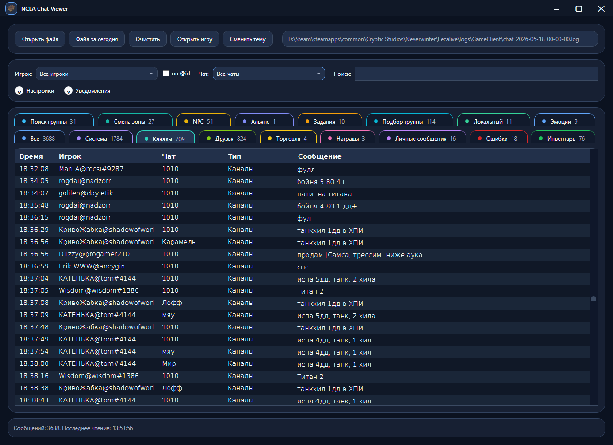

# NCLA Chat Viewer

**NCLA Chat Viewer** — удобный просмотрщик игровых чат-логов **Neverwinter Online** для Windows.

Программа читает файл, который создаётся игровой командой `/chatlog 1`, парсит сообщения и отображает их в нормальном человеческом виде: по вкладкам, с фильтрами, поиском и уведомлениями.

Игровой чат-лог в исходном виде читать неудобно: он большой, шумный и плохо подходит для поиска нужной информации. NCLA Chat Viewer решает эту проблему и превращает лог в удобный инструмент для просмотра истории сообщений.

---

## Скриншоты


*Главное окно — все сообщения по вкладкам с фильтрами и поиском*


*Настройки — пути к файлам, шрифт, интервал обновления и поведение приложения*


*Настройка уведомлений — по типу сообщения, дескриптору игрока или ключевой фразе*


*Уведомление о входящем личном сообщении с кнопкой быстрого открытия игры*

---

## Возможности

- Красивое отображение игровых чатов по вкладкам
- Автоматический парсинг chatlog-файла Neverwinter Online
- Отдельные вкладки для разных типов сообщений
- Поиск сообщений по тексту
- Поиск сообщений по имени игрока
- Поиск сообщений по дескриптору игрока
- Фильтрация личных сообщений
- Уведомления о важных событиях
- Уведомления о входящих личных сообщениях
- Уведомления по ключевым словам или фразам
- Уведомления по конкретному игроку
- Возможность быстро открыть игру из уведомления
- Настройки отображения таблицы
- Настройки уведомлений
- Поддержка звуковых и визуальных уведомлений
- Опциональный режим помощи при длительном бездействии (AntiAway), если игра запущена под окнами

---

## Для чего это может быть полезно

Программа может пригодиться, если вы:

- не хотите пропускать личные сообщения
- хотите видеть важные сообщения поверх других окон
- ждёте, когда конкретный игрок появится в чате
- занимаетесь торговлей и не хотите пропустить сообщения с нужными словами
- ищете сообщения по фразам вроде `ОБМ`, `куплю`, `продам`, `пати`, `ключ`, `данж`
- хотите проверить, обсуждался ли уже какой-то вопрос в чате
- ищете информацию по новым модулям, квестам, зонам или механикам
- хотите читать игровой чат не через неудобный текстовый лог, а через нормальный интерфейс

---

## Как включить запись чата в игре

В Neverwinter Online нужно открыть чат и выполнить команду:

```
/chatlog 1
```

После этого игра начнёт писать лог в папку:

```
...\Neverwinter\Eecalive\logs\GameClient\
```

Файл называется примерно так: `chat_2026-05-20_00-00-00.log`

---

## Скачать

Актуальная версия доступна на странице [Releases](https://github.com/ilchenkoevgeny/NCLAChatViewer/releases).

Скачайте архив `NclaChatViewer-win-x64-vX.X.X.7z`, распакуйте и запустите `NclaChatViewer.exe`.

Установка не требуется.

---

## Системные требования

- Windows 10 / 11 (x64)
- [.NET 8 Desktop Runtime](https://dotnet.microsoft.com/en-us/download/dotnet/8.0) или новее

---

## Лицензия

[MIT](LICENSE)
